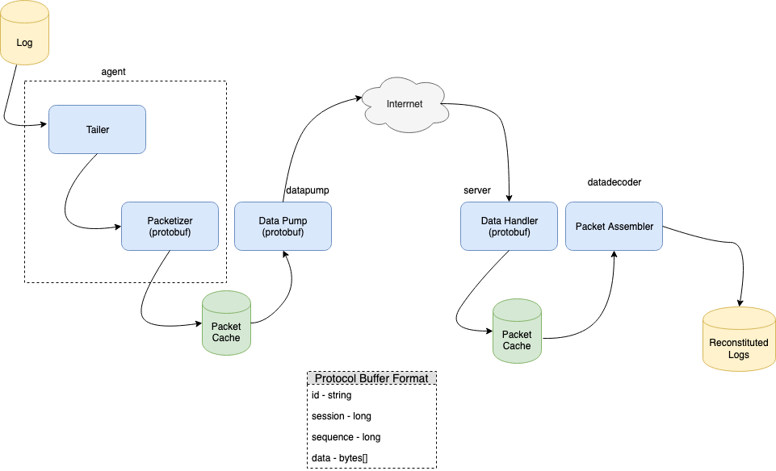

# DataStax Log Aggregator Programming Assignment

## To run the program
These instructions have been tested on a Mac. I would expect them to work on Linux as well. This 
project was build and tested with JDK11.

1) Get a copy (clone or unzip)
2) ```cd datastax```
3) ```gradle build```
4) make a logs directory - so we can redirect stderr and stdout ``mkdir logs`` 
5) run the agent ```java -jar agent/build/libs/agent.jar > logs/agent.out 2>&1 &```
6) run the datapump ```java -jar datapump/build/libs/datapump.jar > logs/datapump.out 2>&1 &```
7) run the server ```java -jar server/build/libs/server.jar > logs/server.out 2>&1 &```
8) run the datadecooder ```java -jar datadecoder/build/libs/datadecoder.jar > logs/datadecoder.out 2>&1 &```
9) generate some logs
   1) Make the log directory ```mkdir LogSource```
   2) Generate some logs
      1) ```nohup ./src/test/logGen > LogSource/log1.log &```
      2) ```nohup ./src/test/logGen > LogSource/log2.log &```
      3) ```nohup ./src/test/logGen > LogSource/log3.log &```
10) ```./src/test/logCheck```
    
    This script can be used to monitor the logs. The LogGen script emits a counter for each line.
    Here's an example of the first two lines:
    ```
    Monday October 28, 2019 23:00:16.124950000 Hello, World! 1
    Monday October 28, 2019 23:00:16.133206000 Hello, World! 2
    ``` 
    This script does a wc -l on the log file and also checks the last count. If they are the same then all 
    is well. There's an outside chance that the file changes between the wc and tail. If there is a 
    discrepancy and then it recovers we can assume all is well.   
    
11) Check the backpressure setting:

    ```curl http://localhost:8080/throttle?seconds=-1```

12) Test the backpressure to 2 minutes:

    ```curl http://localhost:8080/throttle?seconds=120```
    
    After a few minutes you should be able to check the logs to see if the datapump has backed off:
    
    ```grep 'DPumpPusher-1' logs/datapump.out  | grep -A1 sleep```
    
    Here's an example output:
    
    ```
    2019-10-28 22:23:18.716  WARN 40052 --- [  DPumpPusher-1] tjmike.datastax.datapump.AsyncPusher     : Will sleep: 120000
     2019-10-28 22:25:18.728  INFO 40052 --- [  DPumpPusher-1] tjmike.datastax.datapump.AsyncPusher     : PUSH: log3.log_1572314081_260.pbData Code: 200 Message: Throttle: 120
    ```
    
    We can see tha the the the DataPumPusher got the throttle message and went too sleep for 2 minutes.
    
    Set the backpressure to 0 seconds:
    
    ```curl http://localhost:8080/throttle?seconds=0```
     
    Give the jobs a couple minutes to catch back up. 
    
    
13) kill all the processes.
    Another test can be performed if we kill the logGen jobs first:
    ```
    jobs
    [1]   Running                 java -jar agent/build/libs/agent.jar > logs/agent.out 2>&1 &
    [2]   Running                 java -jar datapump/build/libs/datapump.jar > logs/datapump.out 2>&1 &
    [3]   Running                 java -jar server/build/libs/server.jar > logs/server.out 2>&1 &
    [4]   Running                 java -jar datadecoder/build/libs/datadecoder.jar > logs/datadecoder.out 2>&1 &
    [5]   Running                 nohup ./src/test/logGen > LogSource/log1.log &
    [6]-  Running                 nohup ./src/test/logGen > LogSource/log2.log &
    [7]+  Running                 nohup ./src/test/logGen > LogSource/log3.log &
   
    kill %5 %6 %6
    ```
       
    Killing these stops the data 
    ```
    diff  LogSource/log1.log ServerLog/log1.log*[0-9]
    diff  LogSource/log2.log ServerLog/log2.log*[0-9]
    diff  LogSource/log3.log ServerLog/log3.log*[0-9]
    ```
    
    These files should be the same.
    
    Kill the rest of the processes 
     
   
    ```
    kill %1 %2 %3 %4
    '''
        
    
## Solution Discussion

## High Level Design



Below is a discussion of each componenent. 

## Subprojects:

### agent
- Tailer + Packetizer
  - Monitor multiple log files via continuous tail
  - Accept a log chunk and serialize into a protocol buffer
  - Save the serialized Protocol Buffer (cache chunks) to a local cache
  
The agent continuously tails a number of log files. Data is read from each file, serialized and 
pushed to the cache. If no data is captured for a short time (5 seconds) the agent will sleep just 
to prevent spinning. This approach represents an effort to be timely at the expense of capturing smaller chunks.


### data pump
- Monitor the file system cache of log file chunks
- When new files are detected use http to send the files from the cache to the server
   - Delete files from the cache upon successful delivery to server
   - Read a throttle value from the server which will cause the client to sleep for 
     a specified number of seconds before sending more chunks

The data pump is a separate program that monitors the log cache and sends data to the server. By making
it a separate program it can be deployed and maintained separate from the agent.


### server
- Accept log file chunks
- Write to local cache
- Accept throttling parameter to forward to clients

The server listens for data to be pushed to /data. The server responds with a string of the form:

```Throttle: 123```

The client is expected to parse this and back off future request by the number of seconds provided. 

The server also listens for at /throttle. A request like this:

```http request
http://localhost:8080/throttle?seconds=60
``` 

tells the server to inform clients to delay by the amount specified. This request also returns 
the current throttle setting. A request < 0 will be ignorred but the current setting will be returned.


### datadecoder
- Monitor the local server cache for new files
- Assemble the log file chunks into a new log file

The data decoder re-assembles the log files into a single log file. The reconstituted log file will have a
a name of the form NAME.SESSION where NAME is the original log file name and SESSION is the session id of 
the agent session that captured the log. The order of log files with the same name can be determined from the
SESSION but there's no way to know how much (if any) data was lost between sessions.

 

### proto
Protocol Buffers are used as format for serializing log file chunks. The format is:

```
message LogPart {
    string id = 1;
    fixed64 session = 2;
    int64   seq = 3;
    bytes payload = 4;
}
```

The ID is a unique string that encapsulates the log file name. For this exercise we use the log file name as
a unique string id.The session is the milliseconds since the UNIX epoch from when the Agent was started. 
Within the context of a session the seq is the sequence of he log chunk, starting at 1. The payload is the binary log data. The log
server makes no assumption about the nature of the log file, it just captures bytes.


### How would you change the protocol to allow each agent to aggregate multiple log files concurrently?

The current design supports tailing multiple files concurrently. The approach is to leave the files open for reading
and to continuously poll for new data. The protocol has the concept of an ID that uniquely identifies a log file. 
The ID could be defined differently. For example rather than log file name it could be a url describing a unique host 
and file on that host. 

It would be possible to add more fields to the protocol as well to better identify unique hosts and log files.


### How would you design the system to allow aggregation from hundreds of thousands of agents?

The existing model could be extended and scaled where a cluster of web servers is used to accept log file chunks.
The web servers could store the data. A back end process similar to the data decoder could then 
process the stored data to rebuild the logs.

An interesting approach to investigate would be to have the agent send data directly to an S3 bucket.
A lambda function would get fired when the data shows up. The lambda could stitch the files back together. 
If the lambda approach uses too many resources the lambda could be changed to just be a notifier that fires an
event to a back end service that processes the bucket. This back end service could be serverless as well -
something like Fargate. 


### Known issues

The file watch service occasionally throws an exception:
```
JNA: Callback io.methvin.watchservice.MacOSXListeningWatchService$MacOSXListeningCallback@3013909b threw the following exception:
java.lang.IllegalStateException: Could not recursively list files for /Users/mike/mm/code/dxs/datastax/AgentLogCache/
Caused by: java.nio.file.NoSuchFileException: /Users/mike/mm/code/dxs/datastax/AgentLogCache/log2.log_1572297490_1786.pbData.tmp
``` 

This appears to be related to the file system changing state in the middle of a watch operation. The exception doesn't
appear to have a negative impact on the program. I would try to resolve this before placing this library into production.


***

# Original Problem

## Tech interview task: log aggregator

## Design and implement a system for distributed log aggregation.

### Overview

The system will consist of two components - a log forwarding agent and a log aggregation service.
### The agent

The agent is responsible for tailing a given log file and delivering its contents to a remote service in a timely manner.

### The service

The service is responsible for accepting chunked log contents from the client and stitching it together, creating a copy of the original log. The contents of the log reconstructed on the server should preserve the original order of entries (lines).


### Task

Your task is to design a protocol that will satisfy the above requirements and implement a server and client using this protocol. You may use whatever languages, technologies, or frameworks that you feel are appropriate. 
We have a preference for Java, as this team will be writing in Java, but you can make a case for using other languages. Feel free to use your best judgement on assumptions and questions you have, and start a discussion with 
your interviewer if needed.

#### Important implementation considerations for the protocol

- The protocol itself could be based on HTTP or custom TCP/UDP or protocol as long as it is documented and has a working service/agent

- The server can accept log files delivered from multiple concurrent agents

- Avoid losing parts of a log due to network unreliability

- Make sure that the resulting log files on the server don’t contain any duplicate lines

- Consider strategies for coping with back pressure and overflow

#### Additional (design documentation is enough; feel free to implement if you feel like)

- How would you change the protocol to allow each agent to aggregate multiple log files concurrently?

- How would you design the system to allow aggregation from hundreds of thousands of agents?


